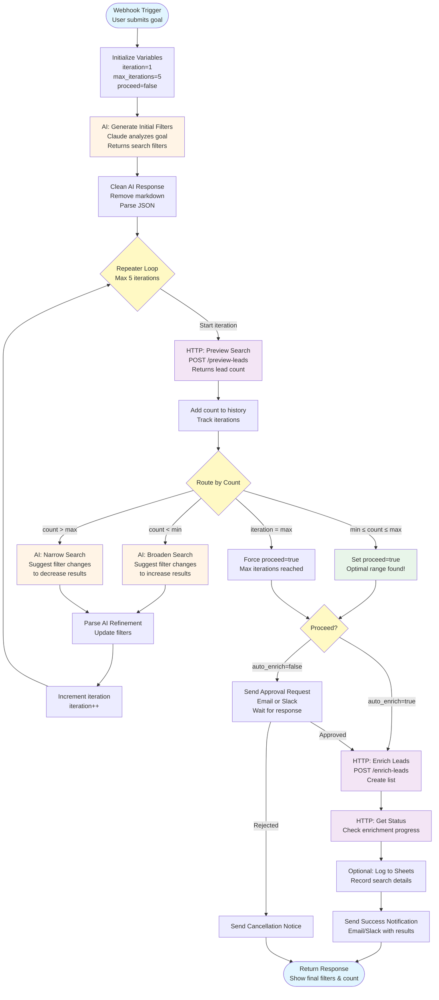

## How to Use This Diagram

### Module Mapping

1. **Blue (Start/End)** - Webhook modules
2. **Orange (AI)** - Anthropic Claude modules
3. **Purple (HTTP)** - Instantly.ai API calls
4. **Green (Success)** - Completion states
5. **Yellow (Decision)** - Routers and conditional logic

### Flow Explanation

#### Phase 1: Initialization (Top)
- Webhook receives user goal
- Variables initialized
- AI generates initial filters

#### Phase 2: Refinement Loop (Middle)
- Preview search → Get count
- Router checks if count is optimal
- If not optimal: AI suggests refinements
- Loop continues until optimal or max iterations

#### Phase 3: Enrichment (Bottom)
- If auto-enrich: Run immediately
- If manual: Wait for approval
- Execute enrichment
- Notify user of completion

### Key Decision Points

1. **Router (Count Check)**
   - Too Few → Broaden
   - Too Many → Narrow
   - Just Right → Proceed
   - Max Iterations → Force proceed

2. **Proceed Decision**
   - Auto-enrich enabled → Enrich immediately
   - Manual approval → Send notification & wait

### Iteration Example

```
Iteration 1: 50,000 leads → Too Many → Narrow to CO only
Iteration 2: 5,000 leads → Too Many → Add company size 10-500
Iteration 3: 1,200 leads → Perfect! → Proceed to enrich
```

## Variables Tracked

- `iteration` - Current loop count (1-5)
- `current_filters` - Active search filters (updated each iteration)
- `lead_counts` - Array of counts from each iteration
- `proceed` - Boolean flag to break loop
- `target_min` / `target_max` - Target lead count range

## Error Handling

Each major module should have error handlers:

- **HTTP Errors** → Retry with exponential backoff
- **AI Parse Errors** → Clean response and retry
- **Rate Limits** → Wait and retry
- **Max Iterations** → Proceed with warning

## Optimization Tips

1. **Reduce Iterations** - Start with better initial filters
2. **Cache Common Searches** - Store successful filters
3. **Use Haiku for Refinement** - Cheaper AI model
4. **Batch Preview Calls** - If searching multiple goals
